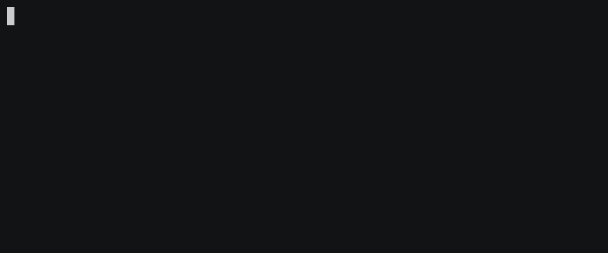

Verdaccio is a multiplatform web application. To install it, you need a few basic prerequisites.

#### Prerequisites

1. Node higher Node `10.x` (LTS "Carbon") is the minimum supported version.

> After v4.5.0 *Node.js v10* is now the minimum supported version. If you cannot upgrade *Node.js v8*, keep using `v4.4.4`.

2. npm `>=5.x` or, `pnpm` or `yarn` 
  > We highly recommend to use the latest Node Package Managers clients `> npm@6.x | yarn@1.x | pnpm@4.x`
3. The web interface supports the `Chrome, Firefox, Edge, and IE11` browsers.

> Verdaccio will support latest Node.js version according the [Node.js Release Working Group](https://github.com/nodejs/Release) recomendations.

<div id="codefund">''</div>

## Installing the CLI

`verdaccio` must be installed globaly using either of the following methods:

Using `npm`

```bash
npm install -g verdaccio
```
or using `yarn`

```bash
yarn global add verdaccio
```




## Basic Usage

Once it has been installed, you only need to execute the CLI command:

```bash
$> verdaccio
warn --- config file  - /home/.config/verdaccio/config.yaml
warn --- http address - http://localhost:4873/ - verdaccio/4.5.0
```

For more information about the CLI, please [read the cli section](cli.md).

You can set the registry by using the following command.

```bash
npm set registry http://localhost:4873/
```

you can pass a ``--registry`` flag when needed.

```bash
npm install --registry http://localhost:4873
```

define in your `.npmrc` a `registry` field.

```bash
//.npmrc
registry=http://localhost:4873
```

Or a `publishConfig` in your `package.json`

```json
{
  "publishConfig": {
    "registry": "http://localhost:4873"
  }
}
```

## Create Your Own Private NPM Package Tutorial

If you still need a deep explanation, don't miss the at [thedevlife](https://mybiolink.co/thedevlife) tutorial how to publish your
own private package using Verdaccio. 

<iframe width="560" height="315" src="https://www.youtube.com/embed/Co0RwdpEsag" frameborder="0" allow="accelerometer; autoplay; encrypted-media; gyroscope; picture-in-picture" allowfullscreen></iframe>

## Docker Image

```bash
docker run -it --rm --name verdaccio -p 4873:4873 verdaccio/verdaccio
```

`verdaccio` has an official docker image you can use, and in most cases, the default configuration is good enough. For more information about how to install the official image, [read the docker section](docker.md).

## Cloudron

`verdaccio` is also available as a 1-click install on [Cloudron](https://cloudron.io)

[](https://cloudron.io/button.html?app=org.eggertsson.verdaccio)

