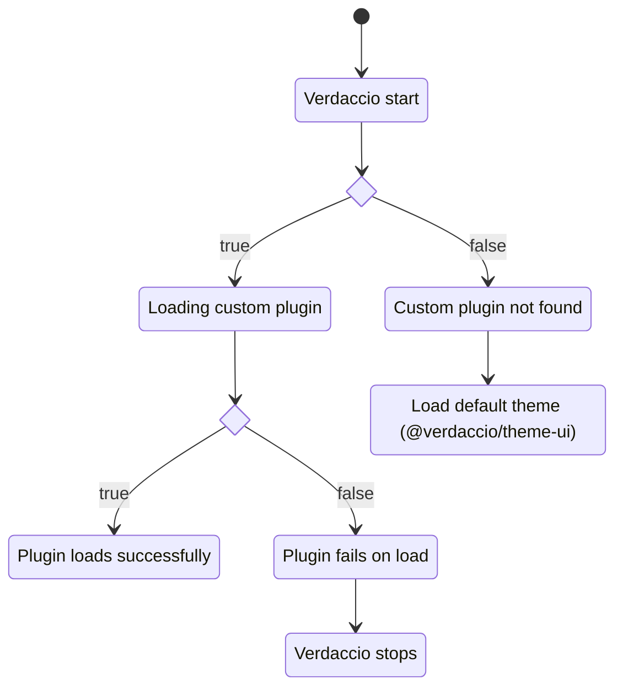

## What's a theme plugin? {#whats-a-theme-plugin}

Verdaccio uses by default a [custom UI](https://www.npmjs.com/package/@verdaccio/ui-theme) that provides a good set of feature to visualize the packages, but might be case your team needs some custom extra features and here is where a custom theme is an option. The plugin store static assets that will be loaded in the client side when the page is being rendered.

### How a theme plugin load phase works?



### How the assets of the theme loads? {#loads}

:::caution

By default the application loads on `http://localhost:4873`, but in cases where a resverse proxy with custom domain are involved the assets are loaded based on the property `__VERDACCIO_BASENAME_UI_OPTIONS.base` and `__VERDACCIO_BASENAME_UI_OPTIONS.basename`, thus only one domain configuration can be used.

:::

The theme loads only in the client side, the application renders HTML with `<script>` tags to render the application, the bundler takes care of load any other assets as `svg`, `images` or _chunks_ associated with it.

### The `__VERDACCIO_BASENAME_UI_OPTIONS` object

The `window.__VERDACCIO_BASENAME_UI_OPTIONS` is available in the browser global context, the shape is documented is defined by the [here](https://verdaccio.org/docs/next/api/types/modules/#templateuioptions) at the `TemplateUIOptions` types definitions.

```js
// output example
{
    "darkMode": false,
    "basename": "/",
    "base": "https://registry.my.org/",
    "primaryColor": "#4b5e40",
    "version": "5.20.1",
    "pkgManagers": [
        "yarn",
        "pnpm",
        "npm"
    ],
    "login": true,
    "logo": "",
    "title": "Verdaccio Registry",
    "scope": "",
    "language": "es-US"
}
```

### Theme Configuration {#theme-configuration}

By default verdaccio loads the `@verdaccio/ui-theme` which is bundled in the main package, if you want to load your custom plugin has to be installed where could be found.

```bash

$> npm install --global verdaccio-theme-dark

```

:::caution
The plugin name prefix must start with `verdaccio-theme-xxx`, otherwise the plugin will be ignored.
:::

You can load only **one theme at a time (if more are provided the first one is being selected)** and pass through options if you need it.

```yaml
theme:
  dark:
    option1: foo
    option2: bar
```

These options will be available

### Plugin structure {#build-structure}

If you have a custom user interface theme has to follow a specific structure:

```
{
  "name": "verdaccio-theme-xxxx",
  "version": "1.0.0",
  "description": "my custom user interface",
  "main": "index.js",
}
```

The main file `index.js` file should contain the following content.

```
module.exports = () => {
  return {
    // location of the static files, webpack output
    staticPath: path.join(__dirname, 'static'),
    // webpack manifest json file
    manifest: require('./static/manifest.json'),
    // main manifest files to be loaded
    manifestFiles: {
      js: ['runtime.js', 'vendors.js', 'main.js'],
    },
  };
};
```

If any of the following properties are not available, the plugin won't load, thus follow this structure.

- `staticPath`: is the absolute/relative location of the statics files, could be any path either with `require.resolve` or build your self, what's important is inside of the package or any location that the Express.js middleware is able to find, behind the scenes the [`res.sendFile`](https://expressjs.com/en/api.html#res.sendFile) is being used.
- `manifest`: A Webpack manifest object.
- `manifestFiles`: A object with one property `js` and the array (order matters) of the manifest id to be loaded in the template dynamically.
- The `manifestFiles` refers to the main files must be loaded as part of the `html` scripts in order to load the page, you don't have to include the _chunks_ since are dynamically loaded by the bundler.

#### Manifest file {#manifest-and-webpack}

Verdaccio requires a [manifest](https://webpack.js.org/concepts/manifest/) object to render the html dynamically, in combination with the `manifestFiles` the application understand what to render.

> Currently only support `js` but if you also need `css`, we are open to discuss it and further improvements.

```
const { WebpackManifestPlugin } = require('webpack-manifest-plugin');

  plugins: [
    ...
    new WebpackManifestPlugin({
      // this is optional depends of your implementation
      removeKeyHash: true,
    }),
    ...
  ],

```

#### Manifest with other bundlers

There is no feedback with other bundlers being used with theme plugins, but with `esbuild` could be possible generate manifests.

Alternatives:

- https://www.npmjs.com/package/esbuild-plugin-manifest

## Components UI {#components}

:::note

The components UI is an experimental feature can be used since verdccio@5.x, it's open to changes and **feedback is welcome**.

:::

Create a new user interface from scratch is big effort, to facilitate the task exist the [@verdaccio/ui-components](https://www.npmjs.com/package/@verdaccio/ui-components) package. The components are based on the **React** library and **Material UI**.

The package export parts of the user interface that could be reused:

- React Hooks
- Providers (React Context API)
- Components
- Sections: **(Sidebar, Detail, Header, Home Page and Footer)**

https://ui-components.verdaccio.org

<iframe src="https://ui-components.verdaccio.org" height="900"></iframe>
